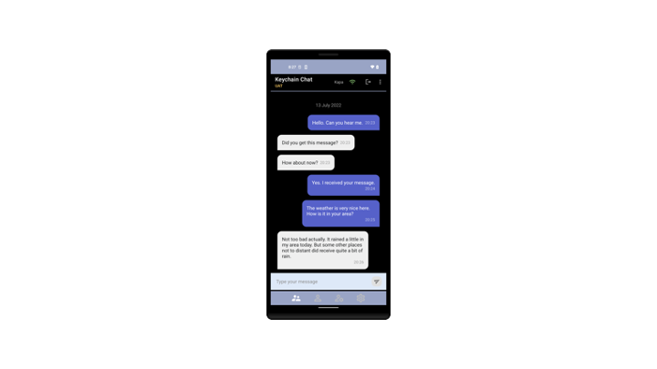
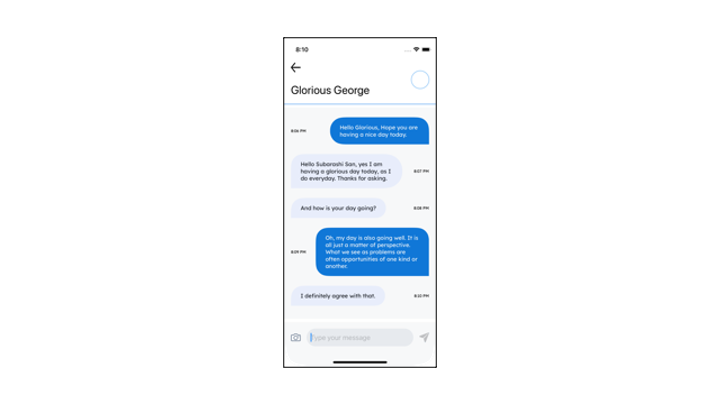

# Keychain Chat Samples
This repository contains sample Chat applications using Android, iOS, and C# .NET. Two or more devices may pair with each other using QR Codes and MQTT. Thereafter they can send end-to-end encrypted and digitally signed messages to each other.

Each sample is located in a corresponding subdirectory of this repository. Please see the README.md files in each project for specific instructions on how to configure, run and use each sample.

## Android Chat Sample

See the [README.md](./keychain-sample-chat-android/README.md) in the `keychain-sample-chat-android subdirectory` for instructions.

## iPhone Chat Sample

See the [README.md](./keychain-sample-chat-iphone/README.md) in the `keychain-sample-chat-iphone subdirectory` for instructions.

## C# .NET Chat Sample

  

  

See the [README.md](./keychain-sample-chat-dot-net/README.md) in the `keychain-sample-chat-dot-net subdirectory` for instructions.
