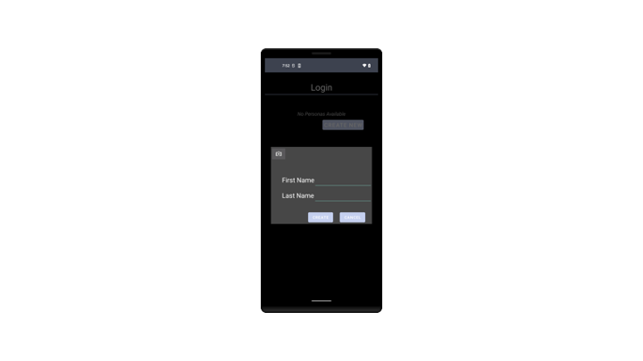
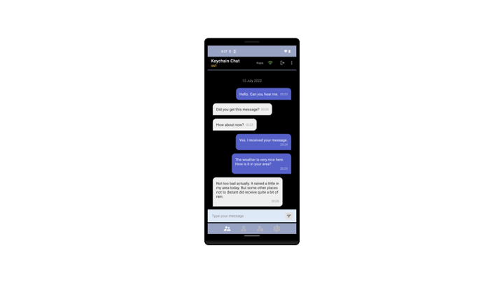

# Keychain Chat Sample Android

## Overview

This is a sample application that was created to demonstrate the practical use of Keychain for creating, managing, and using self sovereign identities for use in a chat application. 
While a chat application was used to demonstrate how Keychain can be used in a chat use case, the focus of this documentation will be on the use of Keychain and not the development of the chat app. 
The implementation details of the chat app will be glossed over, so that we can focus your attention on how to use Keychain in such a use case.

## Requirements
This project is written in Java for Android and requires Android Studio and Android SDK to build and deploy the chat app. All other requirements will be handled automatically by Gradle.

## Assumptions
We assume that you are already familiar with Java programming, Android App development, and Gradle and the MVVM design pattern. 
If you are not familiar with these tools and technologies, please take the time to find a tutorial on YouTube or Google. It is outside the scope of this document to teach these technologies.

## Building the Project

To build and run the sample application, please follow the steps below:

Open the project in Android Studio. If Android SDK is not found on your system, Android Studio will prompt you to choose or download it.

### Select the Build Variant

Select the build variant from the "Build" menu as follows:

`Build`->`Select Build Variant...`

We provide 2 build variant flavors, `dev` and `prod`, but feel free to create more in `build.gradle`.

For quick-start, in the Build Variants panel that is displayed, select `devDebug`.

### Configuration

The files needed to run the chat app are located in the project's `assets` directory as shown in the following image:


There are 2 files that you must modify.

#### keychain.cfg

The most important of these files is the `keychain.cfg` file, which is used to configure the Keychain Core itself.
A basic `keychain.cfg` file ships with every installation of Keychain Core, so you should already have one somewhere on your system.
However, the file in the `assets` directory is used for Android, so you must make sure you either

1. Copy your `keychain.cfg` file over top of the one in the environment-specific `assets/`
2. Copy the specific line that starts `ApiKey = ` from your main `keychain.cfg` into the one in the environment-specific `assets/`

We strongly recommend doing #2 if you are unsure.  Only do #1 if you know your main config file is compatible with this accelerator.

!!! Note Also, if you are operating from behind a firewall that blocks outgoing connections, you (or your network administrator) will need to create firewall rules to allow outgoing connections to the host ip addresses and ports contained in the keychain.cfg file. All ip addresses are for tcp/ip with the exception of the [TrustedDirectory], which uses http.


#### application.properties

This file is used by the chat app and sets up the chat communication channels as well as the trusted directory settings.

Please read the comments in the file and change the appropriate values as suggested.

At minimum, you should change the prefixes to all channels and domains.  If you are hosting your own MQTT server or trusted directory, those should also be pointing to your server.

!!! Note that you may need to add a firewall rule for outgoing tcp/ip connections for the ip address and port.

You should also change the value of `trusted.directory.domain.prefix` to a unique string that represents a repository for chat app users to upload and share their URIs. This is used for pairing purposes.

### Project Structure

The Keychain Chat sample application project is written using the MVVM (Model View ViewModel) design pattern. The project structure is as follows:


* `models` contains the application level data classes. There are other data classes that are part of Keychain SDK
* `views` contains the user interface classes
* `viewmodel` contains the view model classes that implement the business logic and are used by the views to communicate with Keychain and the Chats SQLite database services.
* `interfaces` contains an interface called ChatRepository, with is implemented by the database service
  * You can also use it to implement a different database backend (such as cloud storage) for the chat sample without affecting the rest of the application
* `services` contains service classes that are used to talk to Keychain SDK and the SQLite database

## Running the Project

Build and run the project either on an emulator or through ADB onto an actual real phone.

## Chat High Level Overview

The following is a high level depiction of the architecture of the chat sample application.


The Keychain Chat sample application uses Keychain Core to create and manage sovereign identities. 
These are **digital** identities of the device owner, known as a `Persona`, and those of other devices it has paired with, known as `Contacts`. 

To send messages between devices, it is necessary to first *pair* your device with the other one, essentially creating a `Contact` (the other device) for your `Persona`.
This process is at its core the exchange of DID information (the `Uri` class) so that both devices can find the encrypting and verifying keys for each other on the blockchain.
Though it can be done in many ways, in this application we rely on a Trusted Directory and automatically take care of this step for the user.

Once two devices are paired, they can send messages to one another. 
Because the messages are signed and encrypted, only the contacts to whom you send messages will be able to decrypt and read those messages.

## Using the Application

When you run the chat sample application for the first time, you will need to create a persona. 
A persona is your sovereign digital identity. 
You will need it in order to login and use the chat application. You can create as many personas as you like.


### Create Persona

To create a persona, tap the `CREATE NEW` button to bring up the Create Persona dialog as shown below. Then enter a first and last name for the persona, and tap `CREATE`.



After creating the persona, it goes through the following status changes before it is fully matured and ready for use.  If you miss a status (like `CREATED`) that's OK - as long as there is progression to `CONFIRMED`.

!!! NOTE The states rely on new blocks arriving, and generally speaking it takes ~4 minutes for each new block to come in.  It may take between 12-20 minutes for the newly created persona to fully mature to `CONFIRMED`.

```
CREATED
FUNDING
BROADCASTED
CONFIRMING
CONFIRMED
```

### Login

The following screen shot shown several personas created, with one still not fully confirmed.


To login to the chat application, touch the persona you want to login as. That will take you to the contacts screen. Additionally, the persona's URI will be uploaded to the trusted directory. And using MQTT, the application will subscribe to three topics:

* Messages sent to the logged in persona
* Messages sent to all personas
* Pairing requests/responses

### Contacts Screen

After logging in, you will be taken to the Contacts screen. Any contacts you are paired with will appear in the Contacts screen. Additionally, your persona's URI will also be automatically uploaded to the trusted directory. That will allow other devices that are running Keychain Chat to pair with your device by downloading your persona's URI.


To pair with another device, you can either scan the QR code of the other device running a copy of the Keychain Chat application, or you can have the other device scan your QR code, which is displayed above the list of contacts. Alternatively, you can download the URI's of all devices that have uploaded their persona URIs to the trusted directory.

To scan the QR code of another device, touch the QR code button. That will display the QR Code scanner, which you can then use to scan the other device's QR Code.

To pair with all devices running Keychain Chat that have uploaded their persona URI's to the trusted directory, touch the button to the left of the QR Code. Doing so will cause the application to:

* Download all the URIs from the trusted directory
* Send pair requests to each URI
* If the other device is running Keychain Chat
  * Received the pair request
  * Send pair response back to original sender
  * Call Keychain to create a contact from the pair request
  * The contact will then appear in the contact list
* Receive pair response
  * call Keychain to create a contact from the pair response
  * The contact will then appear in the contact list

The following shows the contacts screen after having paired with 3 other devices.


### Sending Messages

One of the key features of Keychain is that only contacts that a message was intended for will be able to decrypt and read a message. 
In this chat sample application, you can either send messages to one selected contact, or you can send messages to all contacts that you have paired with.

> Please remember that this is a sample application meant to focus on the use of Keychain. In so noting, the recipient of the message must be running and logged in. However, this is a known limitation at the moment.

#### Chatting with One Contact

To chat with one contact, select the contact you want to chat with. Please make sure that the contact you want to chat with is also running Keychain Chat and is logged in. Tap the name of the contact you wish to chat with. This will bring up the conversation screen where you can then chat securely with one contact. As shown below:



The conversation screen is the tab to the far left at the bottom of the screen. Tapping it will display the chats of the last chat session.

#### Chatting with All Contacts

To chat with all contacts at once, who were downloaded from the trusted directory, tap the tab to the right of the conversation tab. Doing so will display the chats screen, which displays a list of contacts you have already been chatting with, one-to-one. Additionally, it contains the `ALL` chat.


Tapping the `ALL` row will allow you to chat with all contacts simultaneously, as shown below:


Whether or not you are chatting with one contact or all, only the contacts that you have paired with and intend to chat with, will be able to decrypt and display the messages.

## Technical Details

The Keychain Chat sample application for Android is written in Java using the Model-View-ViewModel design pattern.

### Initializing Keychain

Before using Keychain to encrypt/decrypt messages, Keychain's `Gateway` class must first be instantiated and initialized. This should only be performed once after starting the application and before using any Keychain functions. In this sample application we wrap the `Gateway` class in a service class called GatewayService. In turn GatewayService is contained in KeychainViewModel, which is used by any views or higher level view models that need to communicate with Keychain.

When KeychainViewModel is instantiated, it gets an singleton instance of GatewayService:


Because KeychainApplication is a singleton, there is only one instance of GatewayService as well. Please keep that in mind, there should only be one instance of Keychain instantiated in your application. GatewayService is created when the application's onCreate method is called, as shown below:


And ultimately, instantiating Keychain is accomplished in the GatewayService by creating an instance of Keychain's Gateway class. After this is completed, it is okay to call methods of the GatewayService that will in turn call Keychain's Gateway class's methods.


Please explore the other functions of the GatewayService class and how they relate to the function calls to Keychain's Gateway class.

## LEGAL DISCLAIMER

THIS SOFTWARE IS PROVIDED "AS-IS". KEYCHAIN EXPRESSLY DISCLAIMS ALL WARRANTIES, EXPRESS AND IMPLIED, INCLUDING, BUT NOT LIMITED TO, THE IMPLIED WARRANTIES OF MERCHANTABILITY AND FITNESS FOR A PARTICULAR PURPOSE. KEYCHAIN DOES NOT WARRANT THAT THE SOFTWARE WILL MEET CLIENT'S REQUIREMENTS, THAT THE SOFTWARE IS COMPATIBLE WITH ANY PARTICULAR HARDWARE OR SOFTWARE PLATFORM, OR THAT THE OPERATION OF THE SOFTWARE WILL BE UNINTERRUPTED OR ERROR-FREE, OR THAT DEFECTS IN THE SOFTWARE WILL BE CORRECTED. THE ENTIRE RISK AS TO THE RESULTS AND PERFORMANCE OF THE SOFTWARE IS ASSUMED BY CLIENT. FURTHERMORE, KEYCHAIN DOES NOT WARRANT OR MAKE ANY REPRESENTATION REGARDING THE USE OR THE RESULTS OF THE USE OF THE SOFTWARE OR RELATED DOCUMENTATION IN TERMS OF THEIR CORRECTNESS, ACCURACY, QUALITY, RELIABILITY, APPROPRIATENESS FOR A PARTICULAR TASK OR APPLICATION, CURRENTNESS, OR OTHERWISE. NO ORAL OR WRITTEN INFORMATION OR ADVICE GIVEN BY KEYCHAIN OR KEYCHAIN'S AUTHORIZED REPRESENTATIVES SHALL CREATE A WARRANTY OR IN ANY WAY INCREASE THE SCOPE OF WARRANTIES PROVIDED.
