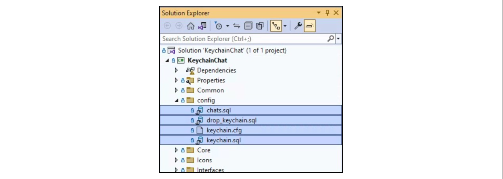
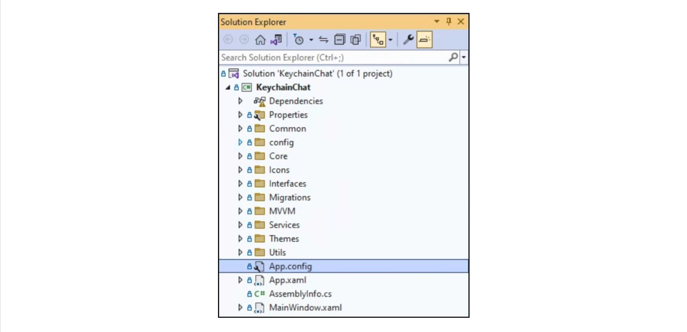
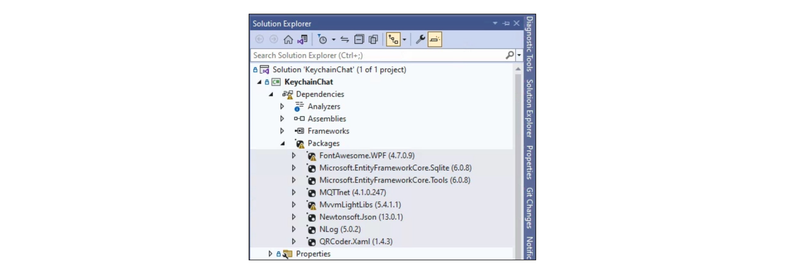
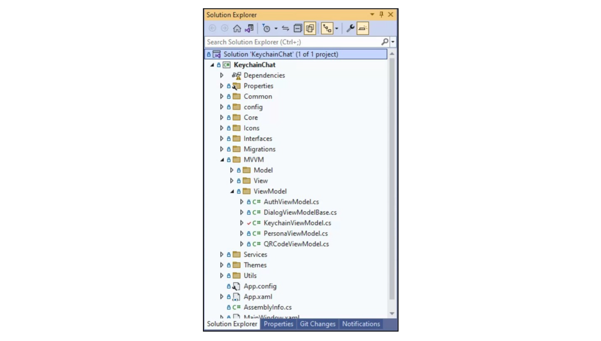
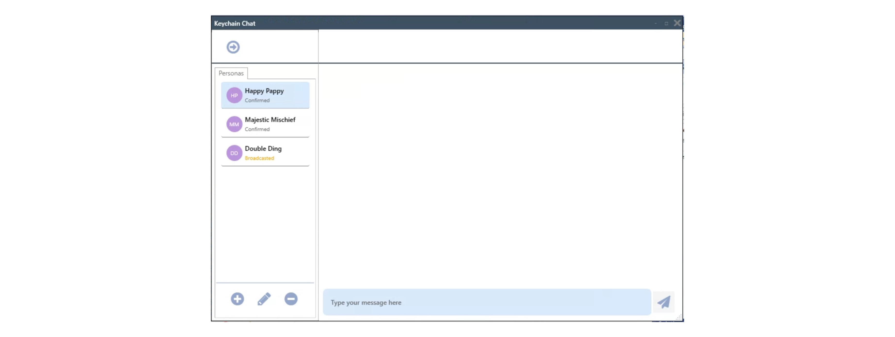
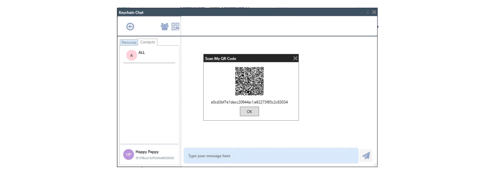
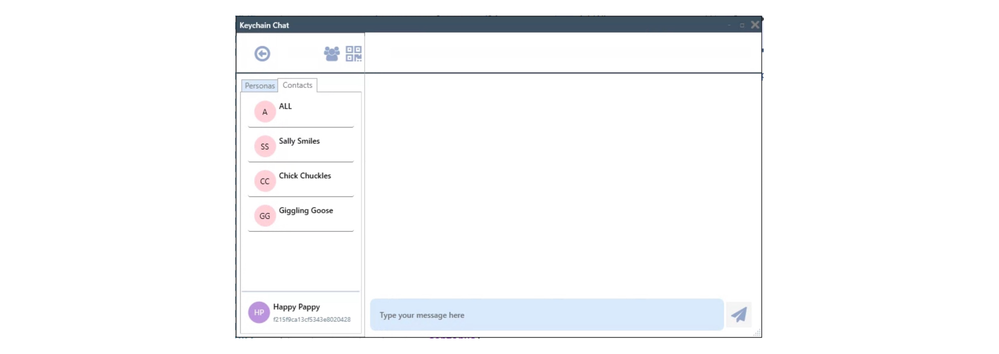
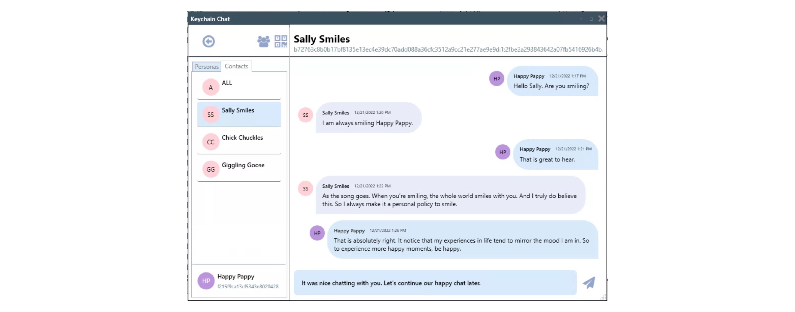
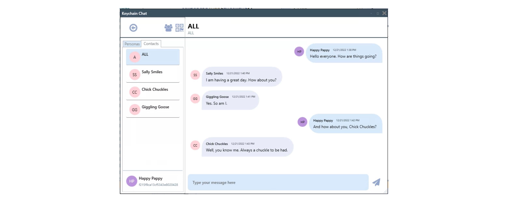

# Keychain Chat .NET Sample

## Overview

This is a sample application that was created to demonstrate the practical use of Keychain for creating, managing, and using self-sovereign identities for use in a chat application. While a chat application was used to demonstrate how Keychain can be used in a chat use case, the focus of this documentation will be on the use of Keychain and not the development of the chat app. The implementation details of the chat app will be glossed over, so that we can focus your attention on how to use Keychain in such a use case.

## Requirements

This project is written in C# .NET for Windows and requires Microsoft Visual Studio. We used Visual Studio 2022 and .NET Framework 6 to develop this sample.

## Assumptions

We assume that you are already familiar with C# and WPF programming as well as the MVVM design pattern. If you are not familiar with these tools and technologies, please take the time to find a tutorial on YouTube or Google. It is outside the scope of this document to teach these technologies.

## Building the Project

To build and run the sample application, please follow the steps below:

### Clone the Project
The project is hosted on GitHub and can be anonymously downloaded from the following link:

```bash
https://github.com/keychain-io/keychain-chat-dot-net/tree/2.4
```

Open the project in Visual Studio.

### Configuration

The files needed to run the chat app are located in the project's config directory as shown in the following image:



With a few exceptions, to be noted later, the following files should not be changed, since they are used internally to initialize the SQLite databases that are used by the application and by the Keychain SDK.

#### keychain.cfg

The most important of these files is the keychain.cfg file, which is used to configure the Keychain SDK itself. Its contents look similar to the following:

```
[Gateway]
AutoRefreshCertificates=yes

[Blockchain]
PrimaryHost = 13.115.198.104
PrimaryQueryPort = 9091
PrimaryHeartbeatPort = 9092
PrimaryBlockPort = 9093
PrimaryTransactionPort = 9094
QueryRetries = 3
QueryTimeoutMsecs = 30000
SubscribeTimeoutMsecs = 3000

[Faucet]
PrimaryHost = 54.65.160.194
PrimaryPort = 3301

[TrustedDirectory]
PrimaryHost = 54.65.160.194
PrimaryPort = 3301

[License]
PrimaryHost = 54.65.160.194
PrimaryPort = 3301
ApiKey = YOURAPIKEYHERE

[Communication]
PrimaryHost = 54.65.160.194
PrimaryPort = 1883

[PairingLedger]
PairingChannel = UAT/chat/pairing/
DirectoryDomainPrefix = NAME-OF-YOUR-CHOOSING

```
In the section labeled `[License]` you will need to paste in a valid ApiKey where is says:

```
ApiKey = YOURAPIKEYHERE
```

Also, if you are operating from behind a firewall that blocks outgoing connections, you (or your network administrator) will need to create firewall rules to allow outgoing connections to the host ip addresses and ports contained in the keychain.cfg file. All ip addresses are for tcp/ip with the exception of the [TrustedDirectory], which uses http.

> It is possible that you will need to change the `ApiKey` under the `[License]` section. Please contact Keychain support at support@keychain.io to acquire an ApiKey if needed.

#### drop_keychain.sql and keychain.sql

The two files, `drop_keychain.sql` and `keychain.sql` are used by Keychain to drop and create the local Keychain database, which it uses internally. You do not need to care about these files, since they are used internally by Keychain.

#### chats.sql

The file `chats.sql` is used to create the SQLite database that is used by the chat application to store chat information that is not stored or managed by Keychain itself, such as chat specific information. You can consider it the application level data needed for a basic chat application. In a real life chat application, similar or additional information may be stored on the device or off device. However, we wanted to keep everything self-contained in this sample in order to eliminate the need to setup external dependencies, such as cloud data storage. And as you will see later in the documentation, we extend an interface in order to use the SQLite implementation. It would be fairly simple for you to extend the same interface and replace our SQLite implementation in order to interact with a different database as your needs may dictate.

#### App.config

The chat application also uses an App.config file to specify configurations for where the databases will be created at runtime. And also for configuring MQTT. MQTT is used to send and receive both pairing and chat messages.



The contents of the App.config file looks similar to the following:

```xml
<?xml version="1.0" encoding="utf-8" ?>
<configuration>
  <appSettings>
    <add key="KeychainConfigFile" value="C:\KeychainChat\config\keychain.cfg" />
    <add key="KeychainDropSqlFile" value="C:\KeychainChat\config\drop_keychain.sql" />
    <add key="KeychainCreateSqlFile" value="C:\KeychainChat\config\keychain.sql" />
    <add key="DBPath" value="C:\KeychainChat\data\keychain.db" />
    <add key="ChatDBPath" value="C:\KeychainChat\data\chats.db" />
    <add key="MqttHost" value="54.65.160.194" />
    <add key="MqttPort" value="1883" />
    <add key="MqttConnectTimeout" value="30"/>
    <add key="MqttKeepAliveSeconds" value="60"/>
    <add key="MqttChannelPairing" value="UAT/chat/pairing/"/>
    <add key="MqttChannelChats" value="UAT/chat/messages/"/>
    <add key="DirectoryHost" value="54.65.160.194"/>
    <add key="DirectoryPort" value="3301"/>
    <add key="DirectoryDomainPrefix" value="MULTI-chat-"/>
    <add key="PairingDomain" value="keychain-chat"/>
    <add key="RefreshInterval" value="3"/>
  </appSettings>
</configuration>
```

Please edit the App.config file to set the directory paths based on where you want the indicated files to reside in your system.

> You may need to add a firewall rule for outgoing tcp/ip connections for the ip address and port.

You should also change the value of `trusted.directory.domain.prefix` to a unique string that represents a repository for chat app users to upload and share their URIs. This is used for pairing purposes. Additionally, if you are also running the chat app samples for the other platforms, the value of this setting must match on all platforms, otherwise, they will not be able to pair with each other.

#### Keychain SDK

You will also need to download the Keychain .NET SDK from the following Artifactory link:

```bash
https://keychain.jfrog.io/ui/native/keychain-core-release-generic/keychain-csharp/2.4.2/
```

After downloading the zip file, unzip it into a directory of your choice (i.e. C:\Keychain). Then in Visual Studio, make sure you reference KeychainCli.dll as shown below:


Moreover, you will also need to install the following NuGet packages as shown below (we assume you know how to do so):




### Project Structure

The Keychain Chat sample application project is written using the MVVM (Model View ViewModel) design pattern. The project structure is as follows:



* `Models` contains the application level data classes. There are other data classes that are part of Keychain SDK
* `Views` contains the user interface classes
* `ViewModel` contains the view model classes that implement the business logic and are used by the views to communicate with Keychain and the Chats SQLite database services.
* `Interfaces` contains interfaces that are used by several services, one of which is IChatRepository, which is implemented by the database service
  * You can also use it to implement a different database backend (such as cloud storage) for the chat sample without affecting the rest of the application
* `Services` contains service classes that are used to talk to the Keychain SDK, chat database and MQTT

## Chat High Level Overview

The following is a high level depiction of the architecture of the chat sample application.


The Keychain Chat sample application uses Blockchain technology for creating and managing sovereign identities. These identities are the digital identities of the device owner, which is known as a Persona, and the digital identities of owners of other devices, known as contacts. In order to send a message to another device running a Keychain chat application, you need to pair your device with a contact that is being used on a different device. Pairing can be performed by scanning a QR Code or by downloading the URIs of contacts from a trusted directory (an http server). Once paired, you can send messages to one contact at a time, or to all contacts at once using MQTT. Because the messages are signed and encrypted, only the contacts to whom you send messages will be able to decrypt and read those messages.

## Using the Application

When you run the chat sample application for the first time, you will need to create a persona. A persona is your sovereign digital identity. You will need it in order to login and use the chat application. You can create as many personas as you like. Each persona you create will represent a different identity. It is like having several representations of yourself on one device.


Above is the login screen before any personas are created.

### Create Persona

To create a persona, click the `+` icon at the bottom left of the screen to bring up the Create Persona dialog as shown below. Then enter a name and sub name for the persona (you can name it whatever you like). Tab out of the Sub Name field and click the Save button.


After creating the persona, it goes through the following status changes before it is fully matured and ready for use:

```
Created
Funding
Broadcasted
Confirming
Confirmed

```

The status of the persona must be `Confirmed` before you can use it to login.

> Please note that it can take several minutes for the persona to become fully confirmed on the Blockchain.

### Login

The following screen shot shown more than one personas created, with one still not fully confirmed.



To login to the chat application, select the persona you want to login as. Then click the login button at the upper left of the screen. That will take you to the contacts tab. Additionally, the persona's URI will be uploaded to the trusted directory. And using MQTT, the application will subscribe to three topics:

* Messages sent to the logged in persona
* Messages sent to all personas
* Pairing requests/responses

### Contacts Tab

After logging in, you will be taken to the Contacts tab. Initially, the only selection that will appear in the Contact tab will be the ALL chat. After you pair with other devices, the paired contacts will appear in the Contacts tab. Additionally, your persona's URI will also be automatically uploaded to the trusted directory, so that other devices can initiate pairing with you. That will allow other devices that are running Keychain Chat to pair with your device by downloading your persona's URI.


To pair with another device, you can either display your selected persona's QR code by clicking the QR code icon at the upper right of the left pane, and have the other device scan your QR code, as shown below:




Alternatively, you can download the URI's of all devices that have uploaded their persona URIs to the trusted directory, by clicking the button the left of the QR code button. This will cause the app to send pairing requests to each of the devices that have uploaded their URI's to the trusted directory. Doing so will cause the application to:

* Download all the URIs from the trusted directory
* Send pair requests to each URI
* If the other device is running Keychain Chat
  * Received the pair request
  * Send pair response back to original sender
  * Call Keychain to create a contact from the pair request
  * The contact will then appear in the contact list
* Receive pair response
  * call Keychain to create a contact from the pair response
  * The contact will then appear in the contact list

The following shows the contacts screen after having paired with other devices.



### Sending Messages

One of the key features of Keychain is that only contacts that a message was intended for will be able to decrypt and read a message. In this chat sample application, you can either send messages to one selected contact, or you can send messages to all contacts at once (broadcast) that you have paired with.

> Please remember that this is a sample application meant to focus on the use of Keychain. In so noting, the recipient of the message must be running and logged in to receive the message. We did not implement push notification in this sample application. We may or may not enhance the sample in the future. However, this is a known limitation at the moment.

#### Chatting with One Contact

To chat with one contact, select the contact you want to chat with. The selected contact is displayed above the conversation pane. Please make sure that the contact you want to chat with is also running Keychain Chat and is logged in. You can then type and send your messages. See the screenshot below.



#### Chatting with All Contacts

To chat with all contacts at once, who were downloaded from the trusted directory, select `ALL` below the `Contacts` tab, as shown below:


This will allow you to chat with all contacts associated with the logged in persona simultaneously. As shown below, the logged in persona is chatting with three contacts simultaneously:



If you are chatting with one contact or all contacts, only the contacts that you have paired with and intend to chat with, will be able to decrypt and display the messages.

## Technical Details

The Keychain Chat sample application for Windows is written in C# and WPF using the Model View ViewModel design pattern.

### Initializing Keychain

Before using Keychain to encrypt/decrypt messages, Keychain's `Gateway` class must first be instantiated and initialized. This should only be performed once after starting the application and before using any Keychain functions. In this sample application we wrap the `Gateway` class in a service class called KeychainService. In turn KeychainService is contained in KeychainViewModel, which is used by any views or higher level view models that need to communicate with Keychain.


When KeychainViewModel is instantiated, it gets an singleton instance of KeychainService:


Ultimately, instantiating Keychain is accomplished in the KeychainService by creating an instance of Keychain's Gateway class. After this is completed, it is okay to call methods of the KeychainService that will in turn call Keychain's Gateway class's methods.


Please explore the functions of the KeychainService class and how they relate to the function calls to Keychain's Gateway class. Also, please explore and note when and where each method it being called by the application.

## LEGAL DISCLAIMER

THIS SOFTWARE IS PROVIDED "AS-IS". KEYCHAIN EXPRESSLY DISCLAIMS ALL WARRANTIES, EXPRESS AND IMPLIED, INCLUDING, BUT NOT LIMITED TO, THE IMPLIED WARRANTIES OF MERCHANTABILITY AND FITNESS FOR A PARTICULAR PURPOSE. KEYCHAIN DOES NOT WARRANT THAT THE SOFTWARE WILL MEET CLIENT'S REQUIREMENTS, THAT THE SOFTWARE IS COMPATIBLE WITH ANY PARTICULAR HARDWARE OR SOFTWARE PLATFORM, OR THAT THE OPERATION OF THE SOFTWARE WILL BE UNINTERRUPTED OR ERROR-FREE, OR THAT DEFECTS IN THE SOFTWARE WILL BE CORRECTED. THE ENTIRE RISK AS TO THE RESULTS AND PERFORMANCE OF THE SOFTWARE IS ASSUMED BY CLIENT. FURTHERMORE, KEYCHAIN DOES NOT WARRANT OR MAKE ANY REPRESENTATION REGARDING THE USE OR THE RESULTS OF THE USE OF THE SOFTWARE OR RELATED DOCUMENTATION IN TERMS OF THEIR CORRECTNESS, ACCURACY, QUALITY, RELIABILITY, APPROPRIATENESS FOR A PARTICULAR TASK OR APPLICATION, CURRENTNESS, OR OTHERWISE. NO ORAL OR WRITTEN INFORMATION OR ADVICE GIVEN BY KEYCHAIN OR KEYCHAIN'S AUTHORIZED REPRESENTATIVES SHALL CREATE A WARRANTY OR IN ANY WAY INCREASE THE SCOPE OF WARRANTIES PROVIDED.
