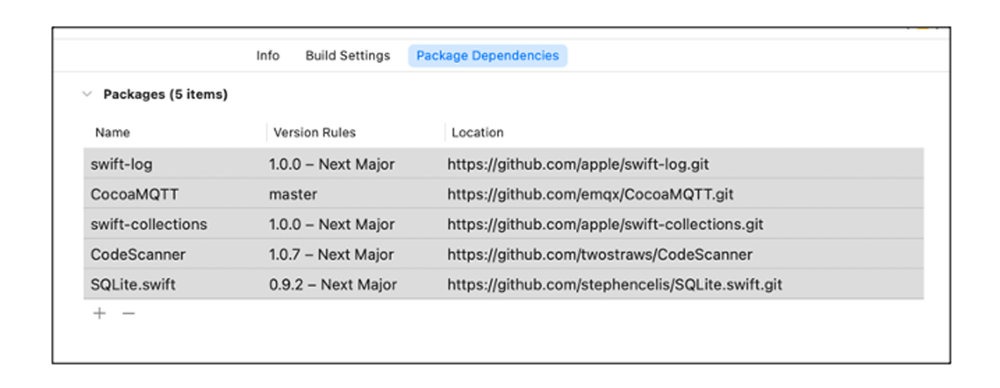
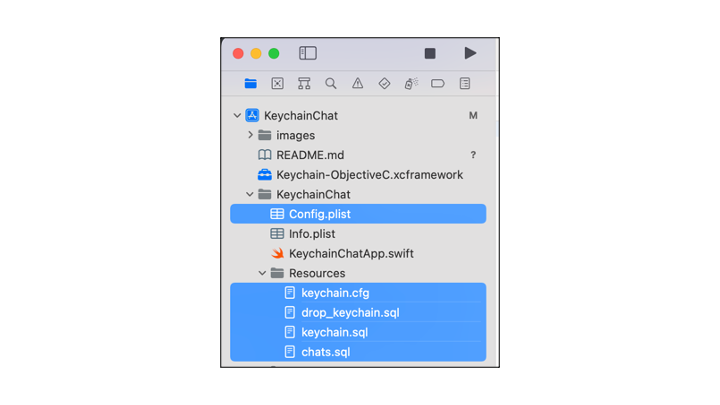
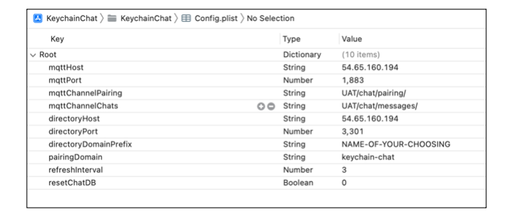
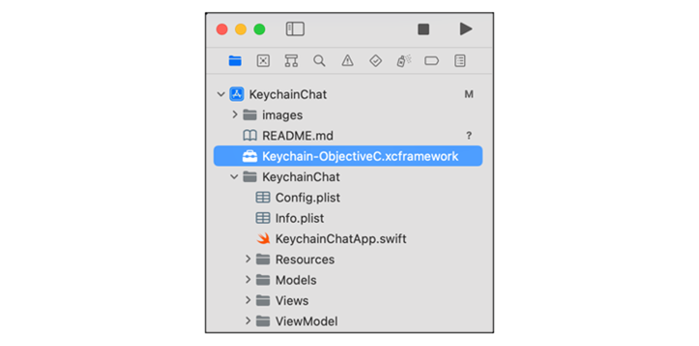
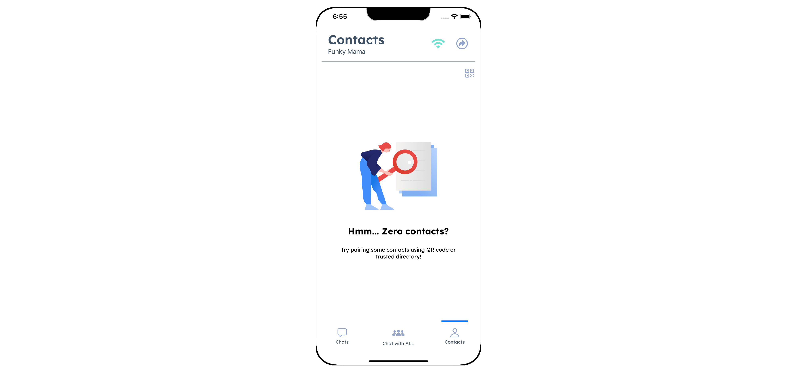
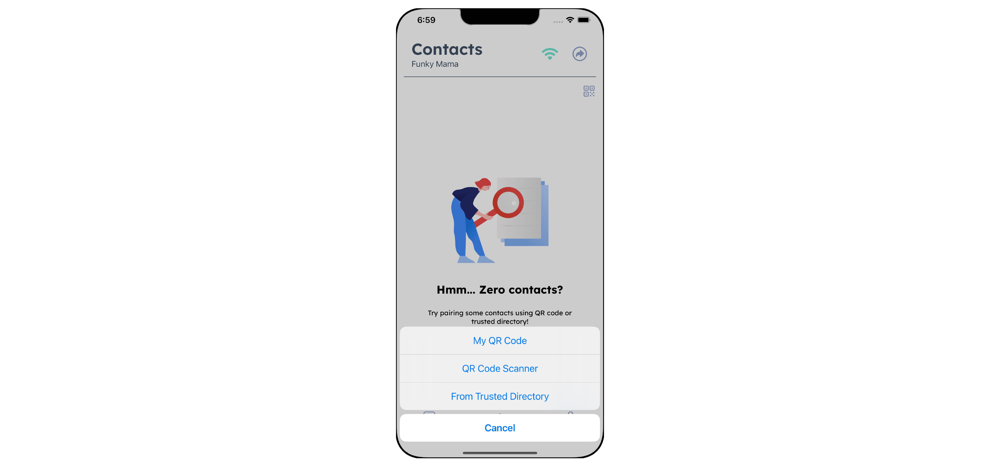
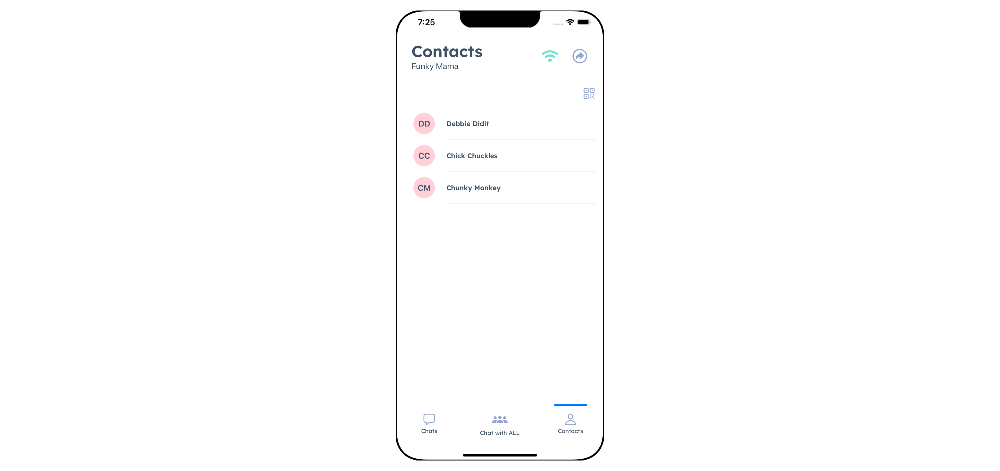
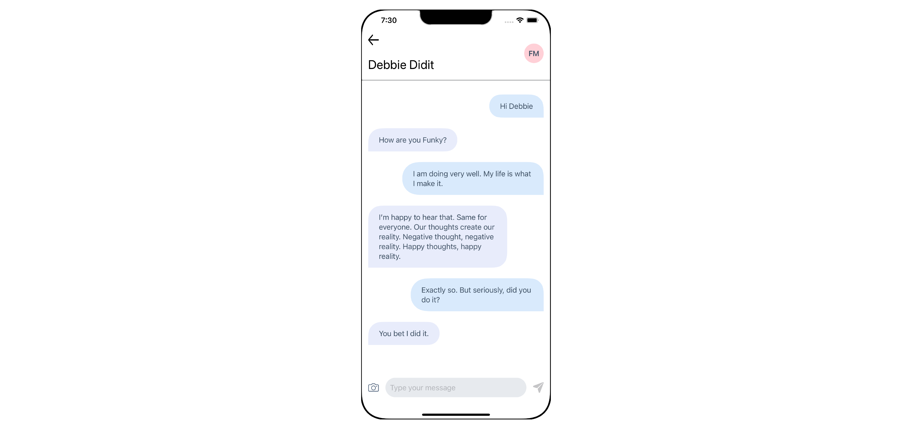
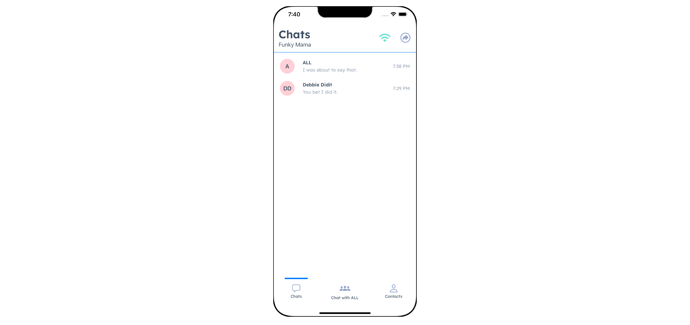
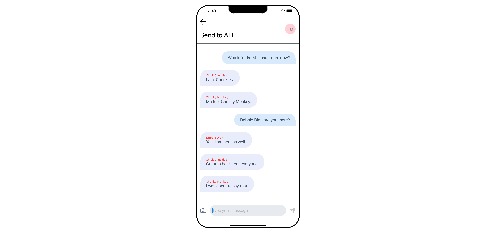

# Keychain Chat Sample iPhone

## Overview

This is a sample application that was created to demonstrate the practical use of Keychain for creating, managing, and using self sovereign identities for use in a chat application. While a chat application was used to demonstrate how Keychain can be used in a chat use case, the focus of this documentation will be on the use of Keychain and not the development of the chat app. The implementation details of the chat app will be glossed over, so that we can focus your attention on how to use Keychain in such a use case.

## Assumptions
We assume that you are already familiar with SwiftUI programming, iPhone App development, Xcode and the MVVM design pattern. If you are not familiar with these tools and technologies, please take the time to find a tutorial on YouTube or Google. It is outside the scope of this document to teach these technologies.

## Building the Project

To build and run the sample application, please follow the steps below:

### Clone the Project
The project is hosted on GitHub and can be anonymously downloaded using the following command in your Android Studio projects directory (or a directory of your choice):

```bash
git clone https://github.com/keychain-io/keychain-sample-chat-iphone/tree/2.4
```

This will clone the project to the following directory:

```
./keychain-sample-chat-iphone
```

Open the project in Xcode.

### Package Dependencies
You may need to update the project dependencies. The package dependencies are highlighted in the image below.



You may need to tell Xcode to update the package dependencies before the project will build.

### Configuration

The files needed to run the chat app are located in the project's assets directory as shown in the following image:



#### keychain.cfg

The most important of these files is the keychain.cfg file, which is used to configure the Keychain SDK itself. It's contents look similar to the following:

```cfg
[Gateway]
AutoRefreshCertificates=yes

[Blockchain]
PrimaryHost = 13.115.198.104
PrimaryQueryPort = 9091
PrimaryHeartbeatPort = 9092
PrimaryBlockPort = 9093
PrimaryTransactionPort = 9094
QueryRetries = 3
QueryTimeoutMsecs = 30000
SubscribeTimeoutMsecs = 3000

[Faucet]
PrimaryHost = 54.65.160.194
PrimaryPort = 3301

[TrustedDirectory]
PrimaryHost = 54.65.160.194
PrimaryPort = 3301

[License]
PrimaryHost = 54.65.160.194
PrimaryPort = 3301
ApiKey = YOURAPIKEYHERE

[Communication]
PrimaryHost = 54.65.160.194
PrimaryPort = 1883

[PairingLedger]
PairingChannel = UAT/chat/pairing/
DirectoryDomainPrefix = NAME-OF-YOUR-CHOOSING
```
In the section labeled `[License]` you will need to paste in a valid ApiKey where is says:

```
ApiKey = YOURAPIKEYHERE
```

Also, if you are operating from behind a firewall that blocks outgoing connections, you (or your network administrator) will need to create firewall rules to allow outgoing connections to the host ip addresses and ports contained in the keychain.cfg file. All ip addresses are for tcp/ip with the exception of the [TrustedDirectory], which uses http.

> It is possible that you will need to change the `ApiKey` under the `[License]` section. Please contact Keychain support at support@keychain.io to acquire an ApiKey if needed.

#### drop_keychain.sql and keychain.sql

The two files, `drop_keychain.sql` and `keychain.sql` are used by Keychain to drop and create the local Keychain database, which it uses internally. You do not need to care about these files, since they are used internally by Keychain.

#### chats.sql

The file `Chats.sql` is used to create the SQLite database that is used by the chat application to store chat information that is not stored or managed by Keychain itself, such as chat specific information. You can consider it the application level data needed for a basic chat application. In a real life chat application, similar or additional information may be stored on the device or off device. However, we wanted to keep everything self contained in this sample in order to eliminate the need to setup external dependencies, such as cloud data storage. And as you will see later in the documentation, we extend an interface in order to use the SQLite implementation. It would be fairly simple for you to extend the same interface and replace our SQLite implementation in order to interact with a different database as your needs may dictate.

#### Config.plist

The chat application uses MQTT to send and receive both pairing and chat messages. The configuration for MQTT is contained in the `Config.plist` file. It's contents is as follows:



> You may need to add a firewall rule for outgoing tcp/ip connections for the ip address and port.

You should also change the value of `directoryDomainPrefix` to a unique string that represents a repository for chat app users to upload and share their URIs. This is used for pairing purposes.

#### Keychain SDK

The Keychain SDK is packaged in the `Keychain-ObjectiveC.xcframework` file as shown below:



The `Keychain-ObjectiveC.xcframework` file contains the Keychain library and ObjectiveC classes that allows us to call Keychain functions from either ObjectiveC or Swift code. The bridging header file shown below, is what allows us to seamlessly interact with the Keychain ObjectiveC framework from Swift.


The contents of the bridging header file is as follows, and is all that is needed in Swift to allow us to use the code contained in the ObjectiveC framework:

```ObjectiveC
//
// Use this file to import your target's public headers that you would
// like to expose to Swift.
//
#import <Keychain-ObjectiveC/Gateway.h>
#import <Keychain-ObjectiveC/Asset.h>
#import <Keychain-ObjectiveC/Persona.h>
#import <Keychain-ObjectiveC/PersonaStatus.h>
#import <Keychain-ObjectiveC/Contact.h>
#import <Keychain-ObjectiveC/Facade.h>
#import <Keychain-ObjectiveC/Uri.h>
#import <Keychain-ObjectiveC/Certificate.h>
#import <Keychain-ObjectiveC/LedgerResult.h>
#import <Keychain-ObjectiveC/LedgerTransaction.h>
#import <Keychain-ObjectiveC/SecurityLevel.h>
#import <Keychain-ObjectiveC/Verification.h>
#import <Keychain-ObjectiveC/WrapperErrorCodes.h>
```

### Project Structure

The Keychain Chat sample application project is written using the MVVM (Model View ViewModel) design pattern. The project structure is as follows:


* `Models` contains the application level data classes. There are other data classes that are part of Keychain SDK, which can be referenced from the bridging header file that was mentioned earlier
* `Views` contains the user interface classes
* `ViewModel` contains the view model classes that implement the business logic and are used by the views to communicate with Keychain and the Chats SQLite database services.
* `Services` contains service classes that are used to talk to Keychain SDK and the SQLite database
* `protocols` contains several protocols used in the chat application, including a protocol named ChatRepository, which is implemented by the database service
  * You can also use it to implement a different database backend (such as cloud storage) for the chat sample without having to modify the rest of the application

## Running the Project

Build and run the project either in a simulator or on an actual phone or tablet.

## Chat Application High Level Overview

The following is a high level depiction of the architecture of the chat sample application.


The Keychain Chat sample application uses Blockchain technology for creating and managing sovereign identities. These identities are the digital identities of the device owner, which is known as a Persona, and the digital identities of owners of other devices, known as contacts. In order to send a message to another device running a Keychain chat application, you need to pair your device with that of a contact. Pairing can be performed by scanning a QR Code or by downloading the URIs of contacts from a trusted directory (an http server). Once paired, you can send messages to one contact at a time, or to all contacts at once using MQTT. Because the messages are signed and encrypted, only the contacts to whom you send messages to will be able to decrypt and read those messages, and only if you have paired with them.

## Using the Application

When you run the chat sample application for the first time, you will need to create a persona. A persona is your sovereign digital identity. You will need it in order to login and use the chat application. You can create as many personas as you like.


Above is the login screen before any personas are created.

### Create Persona

To create a persona, tap the button at the upper right of the screen to bring up the Create Persona dialog as shown below. Then enter a first and last name for the persona, and tap `CREATE`. While you can add a profile image, the image will not be displayed in the application. This is a known bug and may or may/not be fixed in the future.


After creating the persona, it goes through the following status changes before it is fully matured and ready for use:

```
NOSTATUS
CREATED
FUNDING
BROADCASTED
CONFIRMING
CONFIRMED
EXPIRING
EXPIRED

```

Once the status reaches `CONFIRMED` it stays confirmed. EXPIRING and EXPIRED need not be dealt with in this sample application.

The status of the persona must be `CONFIRMED` before you can use it to login.

> Please note that it can take several minutes for the persona to become fully confirmed on the Blockchain.

### Login

The following screen shot shows several personas created, with one still not fully confirmed.


To login to the chat application, touch the persona you want to login as. That will take you to the contacts screen. Additionally, the persona's URI will be uploaded to the trusted directory. And using MQTT, the application will subscribe to three topics:

* Messages sent to the logged in persona
* Messages sent to all personas
* Pairing requests/responses

### Contacts Screen

After logging in, you will be taken to the Contacts screen. Any contacts you are paired with will appear in the Contacts screen. Additionally, your persona's URI will also be automatically uploaded to the trusted directory. That will allow other devices that are running Keychain Chat to pair with your device by downloading your persona's URI.



To pair with another device, you can either scan the QR code of the other device that is running a copy of the Keychain Chat application, or you can have the other device scan your QR code. Alternatively, you can download the URI's of all devices that have uploaded their persona URIs to the trusted directory, and pair with each of them.

To pair with another device, touch the QR code button. You will be presented with three choices, to display your QR code, use your QR code scanner, or pair using the trusted directory, as shown below:



If you elect to display your QR code so that another device can scan it and send you a pairing request, you will see a screen similar to the following:


If you pair by scanning the other device's QR code, the following steps take place:

* Send pair request the URI in the QR code
* If the other device is running Keychain Chat
  * Received the pair request
  * Send pair response back to original sender
  * Call Keychain to create a contact from the pair request, after receiving an Ack back from the other device
  * The contact will then appear in the contact list
* Receive pair response
  * call Keychain to create a contact from the pair response
  * The contact will then appear in the contact list
  * Send an Ack back to the other device

If you pair using the following trusted directory, the following steps take place:

* Download all the URIs from the trusted directory
* Send pair requests to each URI
* If the other device is running Keychain Chat
  * Received the pair request
  * Send pair response back to original sender
  * Call Keychain to create a contact from the pair request, after receiving an Ack back from the other device
  * The contact will then appear in the contact list
* Receive pair response
  * call Keychain to create a contact from the pair response
  * The contact will then appear in the contact list
  * Send an Ack back to the other device

The following shows the contacts screen after having paired with 3 other devices.



### Sending Messages

One of the key features of Keychain is that only contacts that a message was intended for will be able to decrypt and read a message. In this chat sample application, you can either send messages to one selected contact, or you can send messages to all contacts that you have paired with.

> Please remember that this is a sample application meant to focus on the use of Keychain. In so noting, the recipient of the message must be running and logged in. We may or may not enhance the sample in the future. However, this is a known limitation at the moment.

#### Chatting with One Contact

To chat with one contact, select the contact you want to chat with. Please make sure that the contact you want to chat with is also running Keychain Chat and is logged in. Tap the name of the contact you wish to chat with. This will bring up the conversation screen where you can then chat securely with one contact. As shown below:



#### Chatting with All Contacts

To chat with all contacts at once, who were downloaded from the trusted directory, tap the tab at the bottom of the screen, entitled `Chat with ALL`. Alternatively, you can tap the tab at the bottom labeled `Chats`, which displays the last chats you had with each contact as well as with the ALL chats group. Then tab the `ALL` chats row to chat with all contacts.

Doing so will display the conversation screen, which displays messages sent and received to the ALL chats group. Contacts that have not paired with you will receive the messages, but will not be able to decrypt nor display them until after they have paired with you.





Whether or not your are chatting with one contact or all, only the contacts that you have paired with and intend to chat with, will be able to decrypt and display the messages.

## Technical Details

The Keychain Chat sample application for Android is written in SwiftUI using the Model View ViewModel design pattern.

### Initializing Keychain

Before using Keychain to encrypt/decrypt messages, Keychain's `Gateway` class must first be instantiated and initialized. This should only be performed once after starting the application and before using any Keychain functions. In this sample application we wrap the Keychain `Gateway` class in a service class called KeychainService. In turn KeychainService is contained in ChatViewModel, which is used by any views or higher level view models that need to communicate with Keychain.

When ChatViewModel is instantiated, it gets an singleton instance of KeychainService:

```Swift
class ChatViewModel: ObservableObject,
                     Refreshable,
                     MqttMessageHandler,
                     ViewAction,
                     LoginListener{
    let log = Logger(label: ChatViewModel.typeName)

    let config = AppConfig.get()

    var mqttService = MqttService.shared()
    var isMqttAlreadyConnected = false

    @Published var persona: Persona?
    @Published var contacts = [Contact]()

    @Published var chats = [Chat]()
    @Published var selectedChat: Chat?
    @Published var messages = [ChatMessage]()

    @EnvironmentObject var loginViewModel: AuthViewModel

    @Published var notificationMessage = ""

    @State var isShowingSendToQRCode = false
    @State var isShowingMyQRCode = false
    @State var isChatShowing = false

    var keychainService = KeychainService.instance
```


Because KeychainService is a singleton, only one instance of KeychainService is created. Please keep that in mind, there should only be one instance of Keychain's Gateway instantiated in your application.

And ultimately, instantiating Keychain's Gateway is accomplished in the KeychainService by creating an instance of Keychain's Gateway class. After this is completed, it is okay to call methods of the keychainService that will in turn call Keychain's Gateway class's methods.

```Swift
class KeychainService {
    let log = Logger(label: KeychainService.typeName)

    @Published var activePersona: Persona?

    var chatRepository: ChatRepository = SQLiteDBService()

    var wasMonitorStarted = false

    let appConfig = AppConfig.get()

    var configPath: String?
    var dropDbPath: String?
    var createDbPath: String?
    var dbPath: String?

    static let instance: KeychainService? = {
        do {
            let instance = try KeychainService()

            return instance
        } catch {
            Logger(label: KeychainService.typeName).error("Error initializing gateway: \(error)")
        }

        return nil
    }()

    var gateway: Gateway?

    private var monitorService: MonitorService?

    private init() throws {
        try initializePaths()

        guard let configFile = configPath,
              let dropDbFile = dropDbPath,
              let createDbFile = createDbPath,
              let dbFilePath = dbPath else {
                  throw KeychainError.unexpected
              }

        let databasePath = "\(dbFilePath)/keychain.db"

        gateway = try Gateway(configFile,
          databasePath,
          false,
          dropDbFile,
          createDbFile)

        monitorService = try MonitorService(
          dbFilePath: databasePath,
          gateway: gateway,
          refreshInterval: appConfig.refreshInterval)

        let address = ""
        let mnemonicList = NSMutableArray()
        try gateway?.seed(address, mnemonicList)

        try chatRepository.createOrOpenDB()
    }
```

Please explore the other functions of the KeychainService class and how they relate to the function calls to Keychain's Gateway class.

## LEGAL DISCLAIMER

THIS SOFTWARE IS PROVIDED "AS-IS". KEYCHAIN EXPRESSLY DISCLAIMS ALL WARRANTIES, EXPRESS AND IMPLIED, INCLUDING, BUT NOT LIMITED TO, THE IMPLIED WARRANTIES OF MERCHANTABILITY AND FITNESS FOR A PARTICULAR PURPOSE. KEYCHAIN DOES NOT WARRANT THAT THE SOFTWARE WILL MEET CLIENT'S REQUIREMENTS, THAT THE SOFTWARE IS COMPATIBLE WITH ANY PARTICULAR HARDWARE OR SOFTWARE PLATFORM, OR THAT THE OPERATION OF THE SOFTWARE WILL BE UNINTERRUPTED OR ERROR-FREE, OR THAT DEFECTS IN THE SOFTWARE WILL BE CORRECTED. THE ENTIRE RISK AS TO THE RESULTS AND PERFORMANCE OF THE SOFTWARE IS ASSUMED BY CLIENT. FURTHERMORE, KEYCHAIN DOES NOT WARRANT OR MAKE ANY REPRESENTATION REGARDING THE USE OR THE RESULTS OF THE USE OF THE SOFTWARE OR RELATED DOCUMENTATION IN TERMS OF THEIR CORRECTNESS, ACCURACY, QUALITY, RELIABILITY, APPROPRIATENESS FOR A PARTICULAR TASK OR APPLICATION, CURRENTNESS, OR OTHERWISE. NO ORAL OR WRITTEN INFORMATION OR ADVICE GIVEN BY KEYCHAIN OR KEYCHAIN'S AUTHORIZED REPRESENTATIVES SHALL CREATE A WARRANTY OR IN ANY WAY INCREASE THE SCOPE OF WARRANTIES PROVIDED.
